# SOP APROVIVA Villa Valencia — Manual de uso por roles

**Versión:** 2026-05-01
**Sistema:** APROVIVA Operaciones + Portal Residentes Villa Valencia
**URL producción:** <https://villavalencia.vercel.app>
**Versión renderizada en la app:** entrar a APROVIVA Operaciones y abrir **SOP** en el menú o desde Inicio.
**Audiencia:** Residentes, Conserjería, Supervisión, Gerencia/Administración y Junta Directiva
**Estado:** Piloto controlado / demo operativa

---

## 1. Propósito

Este SOP explica, paso a paso, cómo usar APROVIVA Villa Valencia según cada rol.

El objetivo es que cualquier persona pueda operar sin adivinar:

- dónde entrar;
- qué módulo usar;
- qué información registrar;
- qué información **NO** registrar;
- cómo revisar evidencia, reportes y decisiones.

> **Regla principal:** si algo no está claro, no inventes datos. Registra solo hechos verificables y avisa a la administración.

---

## 2. Reglas de oro

1. **Privacidad primero.**
   No escribas números de cuenta, cédulas, tarjetas, contraseñas, conversaciones privadas, datos bancarios ni información personal de terceros.

2. **Evidencia operativa, no chisme.**
   Describe hechos: ubicación, fecha, estado, foto del punto o área común, responsable si aplica.

3. **Cada rol hace su parte.**
   Conserjería ejecuta. Supervisión valida y coordina. Gerencia controla. Junta decide. Residentes reportan y consultan.

4. **Los PIN son de demo.**
   Los PIN indicados aquí son para demo/QA o piloto controlado. No representan autenticación final de producción.

5. **No uses datos reales sensibles para probar.**
   Para capacitación, usa ejemplos simples y no privados.

6. **Al terminar una prueba, revisar datos.**
   Algunos flujos operativos pueden crear registros reales. En producción limpia solo debe quedar la semilla autorizada.

---

## 3. Tabla rápida de roles

| Rol | Entrada | PIN demo | Qué puede hacer | Qué NO debe hacer |
| --- | --- | --- | --- | --- |
| **Residente** | Portal público | No requiere PIN | Radicar PQRS, consultar estado, usar mapa de referencia | No entrar a operación interna; no incluir datos privados de terceros |
| **Conserjería / Personal** | APROVIVA Operaciones | `2026` o `CONS26` | Recorridos, inventario, incidencias, operación diaria | No revisar Junta; no modificar datos maestros; no inventar conteos |
| **Supervisión** | APROVIVA Operaciones | `SUP26` | Supervisar recorridos, Plan Maestro, proyectos, reportes operativos | No actuar como Junta; no registrar datos sensibles innecesarios |
| **Gerencia / Administración** | APROVIVA Operaciones | `GER26` | Backlog, proyectos, datos maestros, reportes, coordinación | No usar el sistema para chats privados o datos bancarios |
| **Junta Directiva** | APROVIVA Operaciones | `JD26` | Revisar tablero, riesgos, aprobaciones y Paquete Junta | No ejecutar operación diaria ni alterar registros de campo |

---

## 4. Cómo entrar al sistema

### 4.1 Residentes

1. Abrir: <https://villavalencia.vercel.app>
2. Usar el portal público.
3. No requiere PIN.
4. Desde allí se puede:
   - radicar un PQRS;
   - consultar el estado de un PQRS;
   - abrir el mapa de referencia;
   - revisar accesos y secciones públicas.

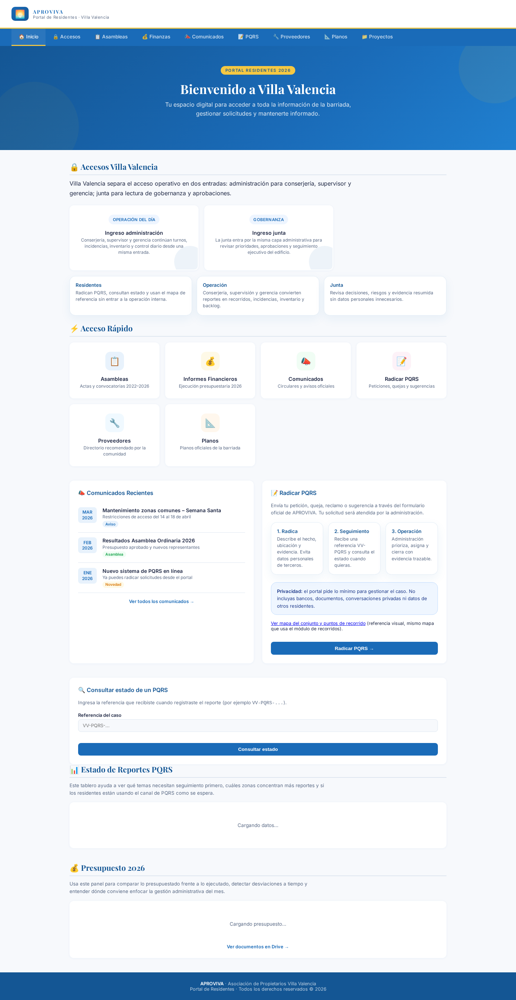

### 4.2 Personal interno, Supervisión, Gerencia y Junta

1. Abrir: <https://villavalencia.vercel.app/aproviva-suite/index.html#/login>
2. Escribir el PIN demo del rol.
3. Presionar **Entrar**.
4. Si se necesita ver los atajos de demo, abrir **Modo demo / QA**.

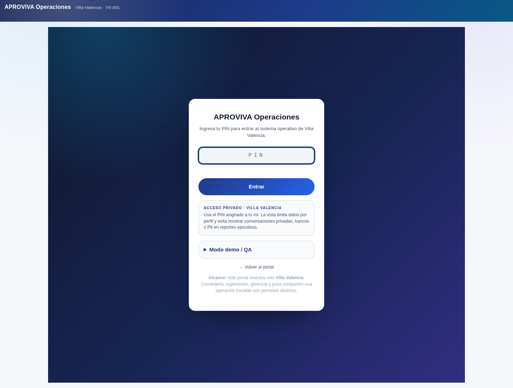

**Si el PIN no entra:** revisar que no haya espacios antes/después, que el PIN esté en mayúsculas cuando aplique, y que se esté usando el rol correcto.

---

# 5. Rol: Residente

## 5.1 Qué hace el residente

El residente usa el portal público para comunicar solicitudes o problemas a la administración.

Puede:

- radicar PQRS;
- adjuntar evidencia si aplica;
- consultar el estado usando la referencia del caso;
- usar el mapa para ubicar mejor el reporte.

No debe:

- escribir datos personales de otros residentes;
- subir documentos sensibles;
- registrar conversaciones privadas;
- usar el PQRS como chat informal.

## 5.2 Radicar un PQRS paso a paso

1. Entrar al portal público.
2. Buscar la sección **Radicar PQRS**.
3. Presionar **Radicar PQRS**.
4. Completar el formulario:
   - **Resumen:** título corto. Ejemplo: `Fuga de agua en área social`.
   - **Descripción:** explicar qué pasó, dónde y desde cuándo.
   - **Tipo de reporte:** seleccionar el tipo que más se acerque.
   - **Ubicación:** seleccionar el área del conjunto.
   - **Urgencia:** alta, media o baja.
   - **Número de casa:** si aplica.
   - **Correo:** opcional, para seguimiento.
   - **Fotos:** opcional, solo si ayudan a entender el problema.
5. Revisar que no haya datos privados de terceros.
6. Presionar **Enviar reporte**.
7. Guardar la referencia `VV-PQRS-...`.

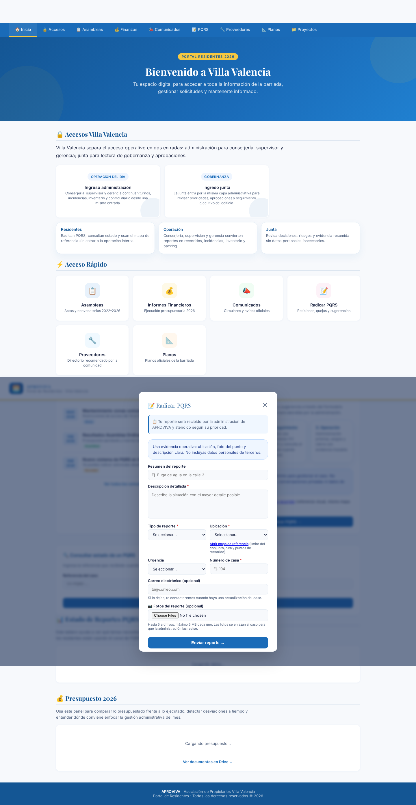

## 5.3 Usar el mapa de referencia

1. Abrir **Mapa del conjunto** desde el portal o desde el formulario PQRS.
2. Revisar el punto o zona correcta.
3. Usar ese nombre de ubicación al describir el PQRS.
4. Recordar: el mapa es **solo lectura**.

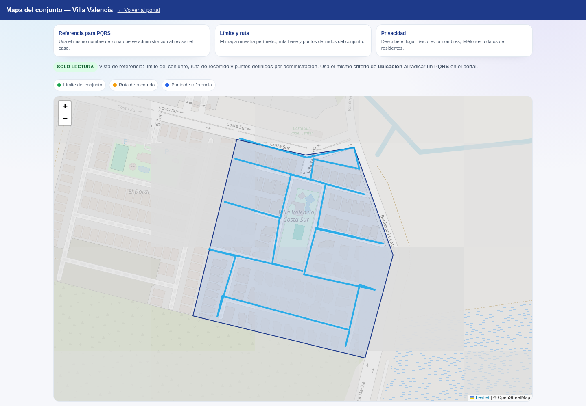

## 5.4 Checklist del residente

Antes de enviar un PQRS:

- [ ] ¿La descripción es clara?
- [ ] ¿La ubicación está seleccionada?
- [ ] ¿La urgencia es razonable?
- [ ] ¿No incluí datos privados de terceros?
- [ ] ¿Guardé la referencia del caso?

---

# 6. Rol: Conserjería / Personal

## 6.1 Qué hace Conserjería

Conserjería ejecuta la operación diaria:

- recorridos;
- conteos de inventario;
- novedades;
- incidencias;
- evidencia de áreas comunes.

PIN demo: `2026` o `CONS26`.

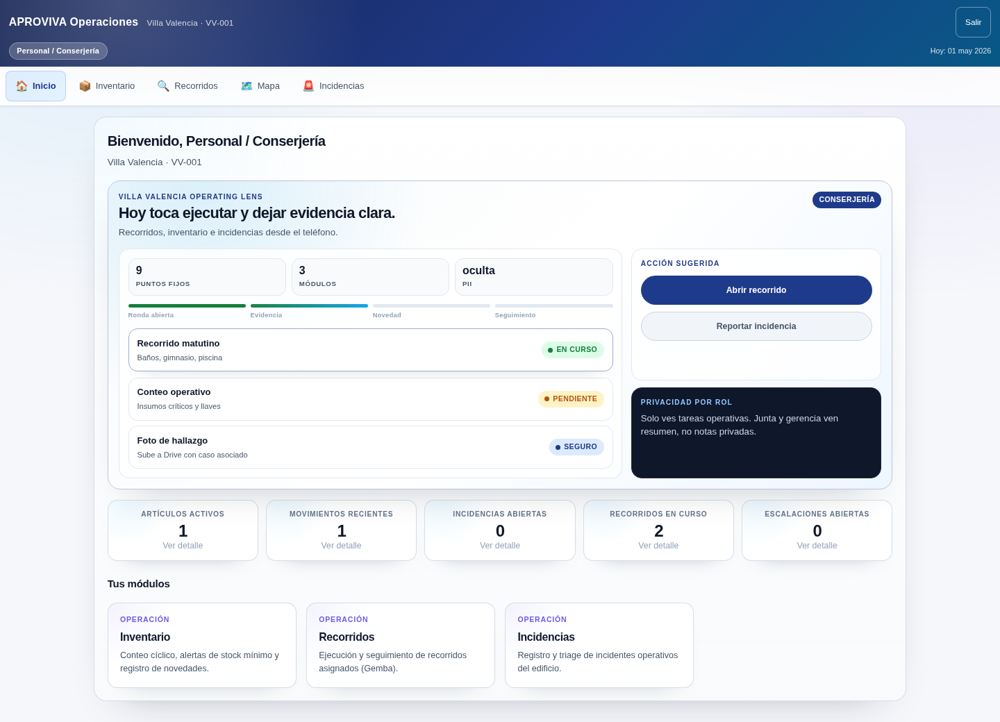

## 6.2 Recorridos

Uso típico:

1. Entrar con PIN de Conserjería.
2. Ir a **Recorridos**.
3. Revisar el siguiente recorrido o punto pendiente.
4. Iniciar o continuar el recorrido si corresponde.
5. Registrar solo hechos:
   - punto revisado;
   - estado observado;
   - hallazgo si existe;
   - evidencia si aplica.
6. Si hay problema, crear hallazgo o incidencia.

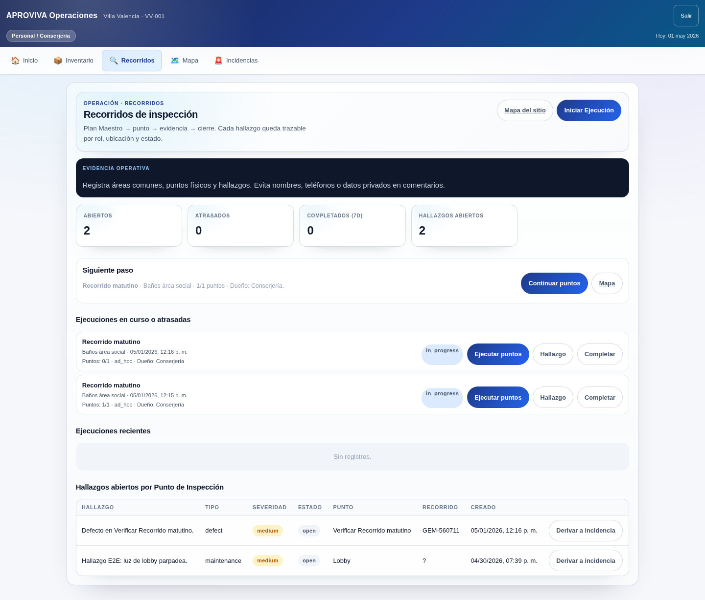

**No escribir:** nombres de residentes, teléfonos, quejas personales, conversaciones privadas o datos que no ayuden a resolver el hallazgo.

## 6.3 Inventario

Uso típico:

1. Ir a **Inventario**.
2. Revisar alertas o siguiente acción.
3. Registrar conteo solo si se verificó físicamente.
4. Si algo falta, reportar novedad.
5. Si el conteo no cuadra, escribir una nota breve y objetiva.

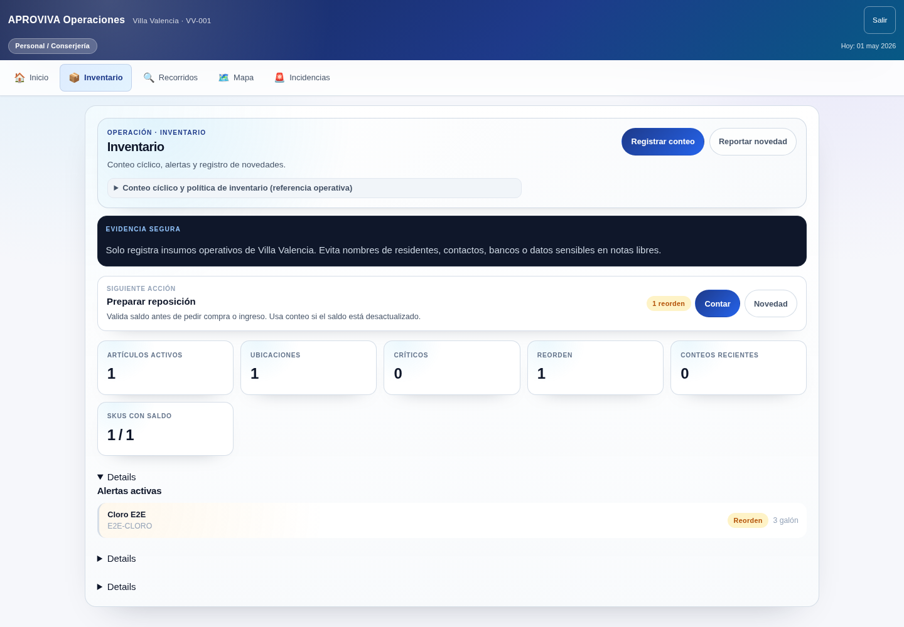

Ejemplo correcto:

> `Cloro: conteo físico 3 unidades en almacén.`

Ejemplo incorrecto:

> `Creo que alguien se llevó cosas.`

## 6.4 Incidencias

Uso típico:

1. Ir a **Incidencias**.
2. Presionar **Nueva incidencia** si hay un hecho operativo.
3. Escribir título y descripción clara.
4. Agregar ubicación y prioridad si aplica.
5. Guardar para que Supervisión/Gerencia haga seguimiento.

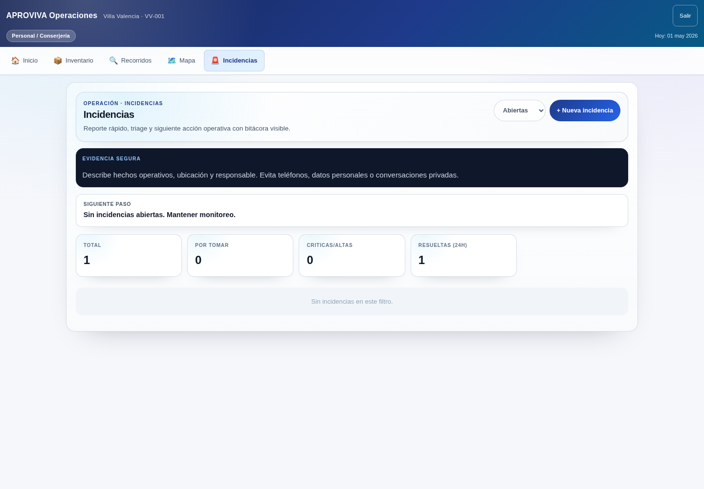

## 6.5 Checklist diario de Conserjería

Al final del turno:

- [ ] ¿Se completaron los recorridos asignados?
- [ ] ¿Se reportaron hallazgos críticos?
- [ ] ¿Se registraron conteos reales, no estimados?
- [ ] ¿Las incidencias tienen ubicación clara?
- [ ] ¿No se escribieron datos privados?

---

# 7. Rol: Supervisión

## 7.1 Qué hace Supervisión

Supervisión convierte la operación diaria en seguimiento ordenado.

Puede:

- revisar recorridos;
- crear o revisar Plan Maestro;
- supervisar backlog/proyectos;
- revisar reportes;
- dar seguimiento a incidencias.

PIN demo: `SUP26`.

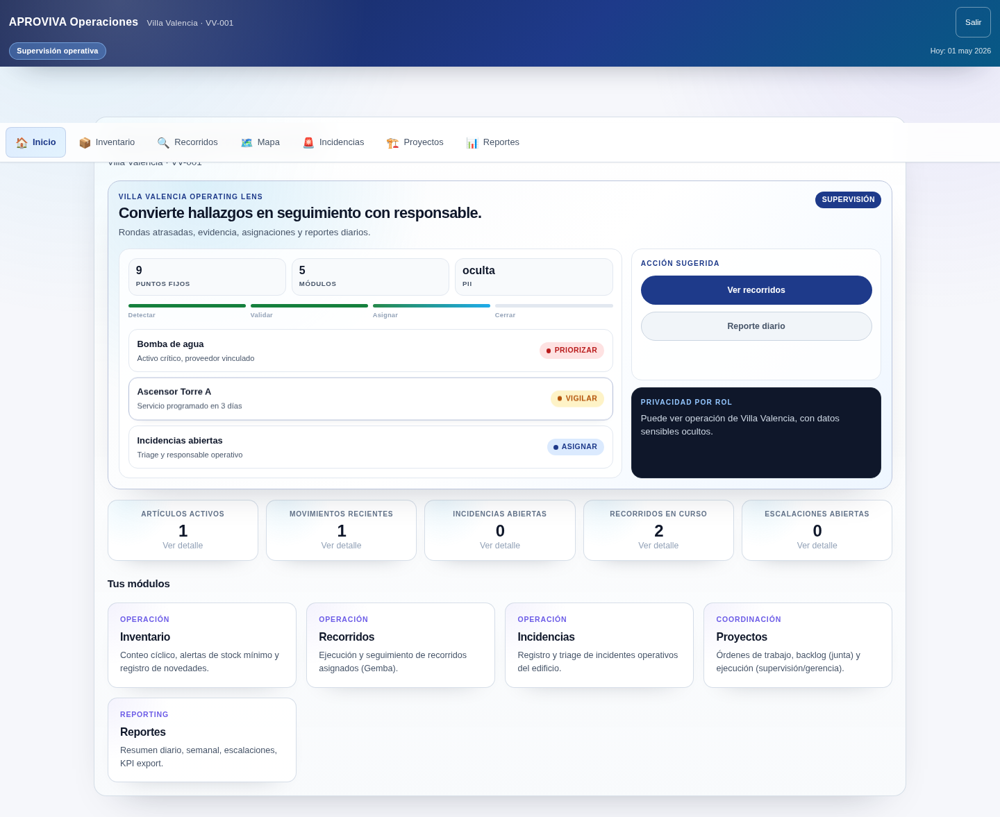

## 7.2 Recorridos y Plan Maestro

1. Entrar con PIN de Supervisión.
2. Ir a **Recorridos**.
3. Revisar recorridos activos, recientes o atrasados.
4. Si corresponde, usar **Nuevo Plan Maestro**.
5. Verificar que cada punto tenga sentido operativo.
6. Revisar hallazgos abiertos y responsables.

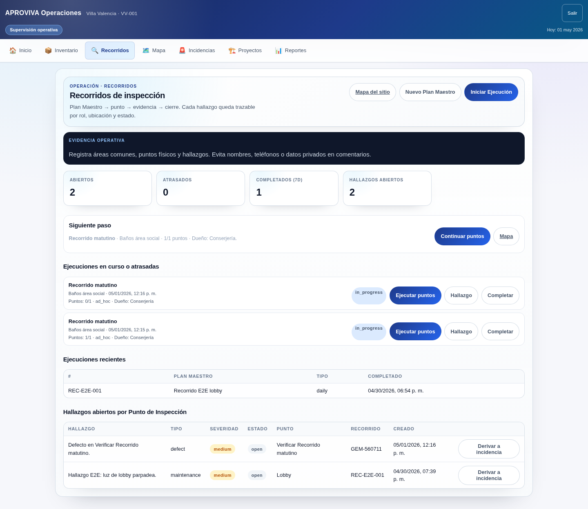

## 7.3 Proyectos / backlog

1. Ir a **Proyectos**.
2. Revisar tareas abiertas.
3. Priorizar por urgencia, riesgo o impacto.
4. Ver si falta responsable, fecha o evidencia.
5. Actualizar seguimiento según la política interna.

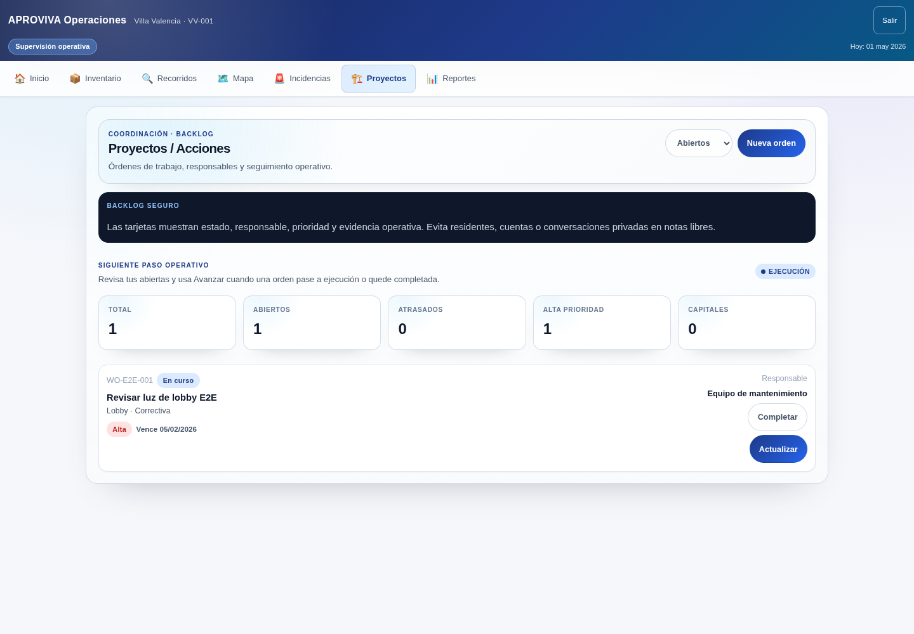

## 7.4 Reportes

1. Ir a **Reportes**.
2. Revisar resumen operativo.
3. Identificar atrasos o puntos que requieren decisión.
4. Escalar a Gerencia si algo necesita aprobación o recurso.

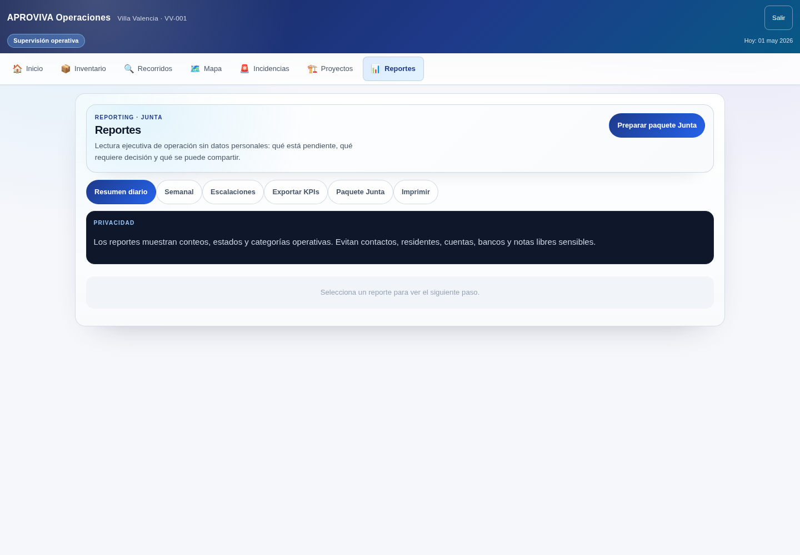

## 7.5 Checklist de Supervisión

Diario/semanal:

- [ ] ¿Hay recorridos atrasados?
- [ ] ¿Hay hallazgos críticos abiertos?
- [ ] ¿Cada tarea importante tiene responsable?
- [ ] ¿Los proyectos tienen prioridad y estado?
- [ ] ¿Gerencia sabe qué necesita decisión?

---

# 8. Rol: Gerencia / Administración

## 8.1 Qué hace Gerencia

Gerencia usa APROVIVA para coordinar la operación completa:

- backlog;
- proyectos;
- datos maestros;
- reportes;
- decisiones operativas;
- preparación de información para Junta.

PIN demo: `GER26`.

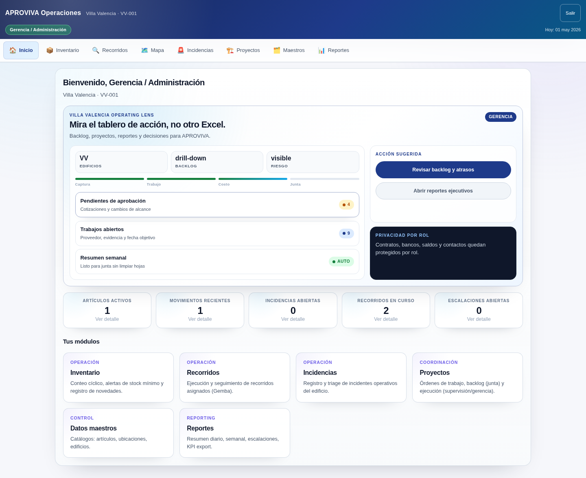

## 8.2 Proyectos y backlog

1. Entrar con PIN de Gerencia.
2. Ir a **Proyectos**.
3. Revisar trabajos abiertos, vencidos o críticos.
4. Confirmar prioridad y responsable.
5. Revisar evidencia disponible.
6. Preparar decisiones que deben subir a Junta.

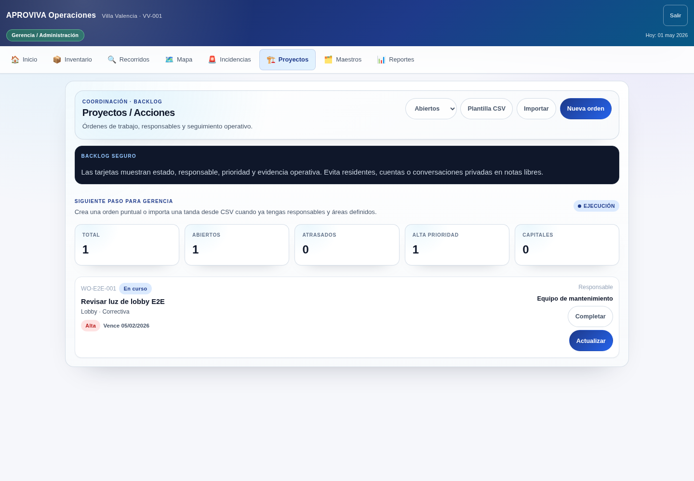

## 8.3 Datos Maestros

Los datos maestros son catálogos base, por ejemplo:

- artículos de inventario;
- ubicaciones;
- edificios;
- administradores visibles.

Uso correcto:

1. Ir a **Datos Maestros**.
2. Crear solo lo necesario.
3. Usar nombres cortos y consistentes.
4. Evitar datos sensibles en campos libres.
5. Revisar duplicados antes de crear algo nuevo.

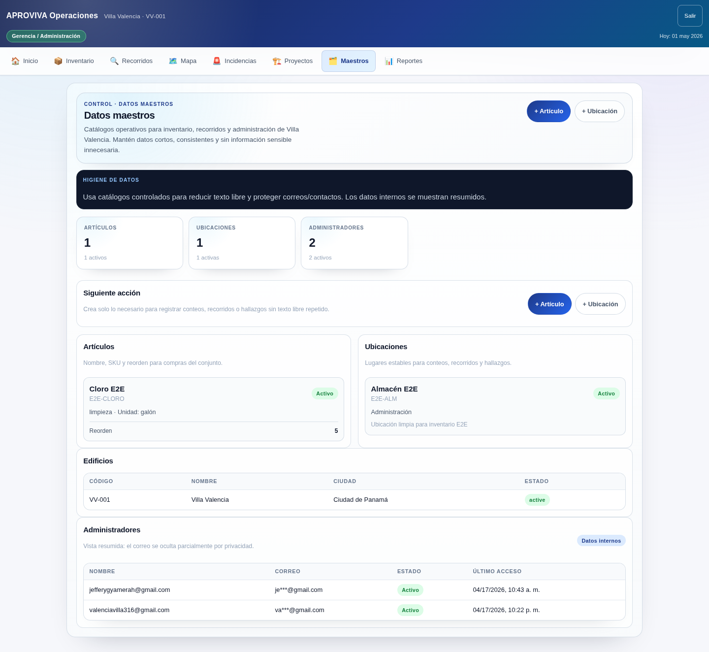

## 8.4 Reportes

1. Ir a **Reportes**.
2. Revisar KPIs y resúmenes.
3. Preparar información para Junta.
4. No incluir datos personales innecesarios en reportes ejecutivos.

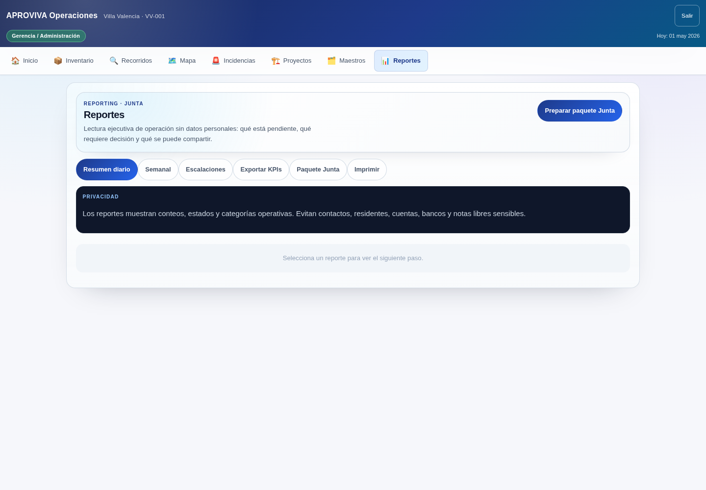

## 8.5 Checklist semanal de Gerencia

- [ ] ¿Backlog revisado y priorizado?
- [ ] ¿Tareas críticas con responsable?
- [ ] ¿Datos maestros limpios, sin duplicados?
- [ ] ¿Reportes listos para revisión?
- [ ] ¿Decisiones para Junta claramente identificadas?

---

# 9. Rol: Junta Directiva

## 9.1 Qué hace Junta

La Junta usa APROVIVA para leer la operación, no para ejecutarla.

Puede:

- revisar indicadores ejecutivos;
- revisar riesgos;
- revisar backlog de aprobación;
- abrir reportes;
- generar o revisar Paquete Junta.

PIN demo: `JD26`.

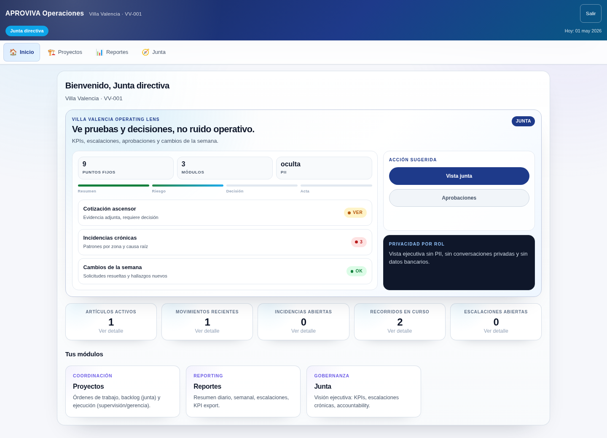

## 9.2 Tablero Junta

1. Entrar con PIN de Junta.
2. Ir a **Junta**.
3. Revisar KPIs principales.
4. Abrir detalles cuando un indicador lo requiera.
5. Identificar:
   - riesgos;
   - atrasos;
   - decisiones pendientes;
   - evidencia disponible.

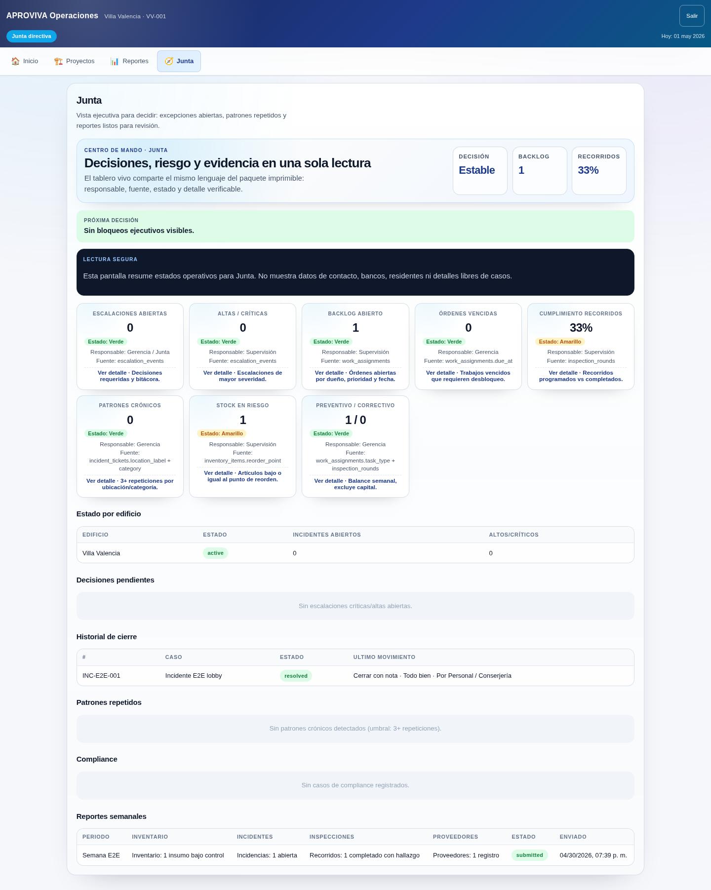

## 9.3 Paquete Ejecutivo para Junta

1. Ir a **Reportes**.
2. Presionar **Paquete Junta**.
3. Revisar:
   - decisiones requeridas;
   - riesgos;
   - scorecard;
   - backlog;
   - evidencia;
   - privacidad.
4. Usar el paquete como base para reunión o acta.

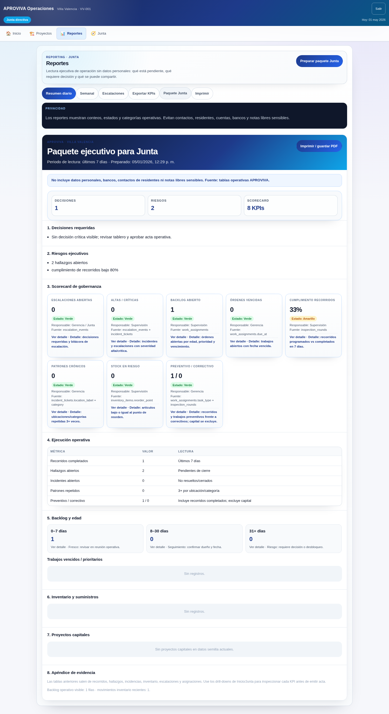

## 9.4 Checklist de Junta

Antes de una reunión:

- [ ] ¿Qué decisiones requiere la administración?
- [ ] ¿Qué riesgos están abiertos?
- [ ] ¿Qué tareas están vencidas?
- [ ] ¿Hay evidencia suficiente?
- [ ] ¿El paquete evita datos personales innecesarios?

---

# 10. Qué módulo usar según la situación

| Situación | Módulo recomendado | Rol principal |
| --- | --- | --- |
| Residente quiere reportar algo | PQRS público | Residente |
| Hay una zona por revisar | Recorridos | Conserjería / Supervisión |
| Falta o sobra un insumo | Inventario | Conserjería / Supervisión |
| Algo está dañado o fuera de lugar | Incidencias | Conserjería |
| Hay una tarea pendiente con responsable | Proyectos | Supervisión / Gerencia |
| Se necesita ordenar catálogos | Datos Maestros | Gerencia |
| Se prepara reunión de Junta | Reportes / Paquete Junta | Gerencia / Junta |
| Junta quiere ver estado general | Junta | Junta Directiva |

---

# 11. Privacidad y evidencia

## 11.1 Sí se debe registrar

- Área común o ubicación.
- Descripción objetiva.
- Estado observado.
- Fecha/hora cuando aplique.
- Foto de la condición física si ayuda.
- Responsable operativo cuando corresponda.

## 11.2 No se debe registrar

- Cédulas.
- Teléfonos personales de terceros.
- Cuentas bancarias.
- Contraseñas.
- Fotos de personas sin necesidad operativa.
- Conversaciones privadas.
- Rumores o acusaciones sin evidencia.

## 11.3 Ejemplos

Correcto:

> `Piscina: filtro con fuga visible. Se adjunta foto del punto.`

Incorrecto:

> `El vecino de la casa X dijo que fulano dañó esto.`

---

# 12. Troubleshooting básico

## 12.1 El PIN no entra

1. Revisar que el PIN esté bien escrito.
2. Verificar mayúsculas: `SUP26`, `GER26`, `JD26`.
3. Probar de nuevo sin espacios.
4. Si sigue fallando, avisar a Gerencia/Admin.

## 12.2 No veo un módulo

Puede ser normal. APROVIVA muestra módulos según rol.

Ejemplos:

- Junta no ve operación diaria completa.
- Conserjería no ve Junta.
- Supervisión puede no ver Datos Maestros.

## 12.3 El mapa no carga

1. Revisar internet.
2. Refrescar la página.
3. Probar en Chrome.
4. Si sigue sin cargar, reportar a administración.

## 12.4 No encuentro mi referencia PQRS

1. Revisar que empiece con `VV-PQRS-`.
2. Copiarla exactamente como fue entregada.
3. Evitar espacios antes o después.
4. Si no aparece, contactar administración.

## 12.5 Pantalla en blanco

1. Refrescar la página.
2. Cerrar y abrir el navegador.
3. Probar ventana incógnita.
4. Si persiste, tomar captura y avisar.

## 12.6 Datos incorrectos

1. No corregir al azar.
2. Tomar captura.
3. Reportar a Supervisión o Gerencia.
4. Si es catálogo base, Gerencia lo revisa en Datos Maestros.

---

# 13. Cierre diario/semanal por rol

## Residentes

- [ ] Guardé mi referencia PQRS.
- [ ] Mi reporte no incluye datos privados.

## Conserjería

- [ ] Recorridos completados o justificados.
- [ ] Incidencias críticas reportadas.
- [ ] Inventario contado físicamente.
- [ ] Sin datos sensibles en notas.

## Supervisión

- [ ] Recorridos atrasados revisados.
- [ ] Hallazgos con seguimiento.
- [ ] Proyectos con responsable.
- [ ] Reportes revisados.

## Gerencia

- [ ] Backlog priorizado.
- [ ] Datos maestros limpios.
- [ ] Reportes listos.
- [ ] Decisiones para Junta identificadas.

## Junta

- [ ] Tablero revisado.
- [ ] Riesgos entendidos.
- [ ] Decisiones listas para acta.
- [ ] Paquete Junta revisado sin PII innecesaria.

---

# 14. Glosario simple

| Término | Significado |
| --- | --- |
| **PQRS** | Petición, Queja, Reclamo o Sugerencia |
| **Backlog** | Lista de tareas pendientes o en seguimiento |
| **Recorrido** | Revisión de puntos físicos del conjunto |
| **Hallazgo** | Algo encontrado durante un recorrido que requiere atención |
| **Incidencia** | Evento operativo que debe registrarse y atenderse |
| **Datos Maestros** | Catálogos base: artículos, ubicaciones, edificios, administradores |
| **Paquete Junta** | Reporte ejecutivo para reunión o revisión de Junta |
| **PII** | Información personal identificable; debe evitarse en reportes ejecutivos |
| **PIN demo** | Código temporal para demo/QA o piloto controlado |

---

# 15. Anexo de capturas

| # | Captura | Uso |
| --- | --- | --- |
| 01 | [Portal residentes — inicio](assets/sop-villa-valencia/01-portal-residentes-inicio.png) | Entrada pública |
| 02 | [Residente — radicar PQRS](assets/sop-villa-valencia/02-residente-radicar-pqrs.png) | Formulario PQRS |
| 03 | [Residente — mapa PQRS](assets/sop-villa-valencia/03-residente-mapa-pqrs.png) | Referencia visual |
| 04 | [Login operaciones](assets/sop-villa-valencia/04-login-operaciones.png) | Acceso interno |
| 05 | [Conserjería — inicio](assets/sop-villa-valencia/05-conserjeria-inicio.png) | Inicio rol personal |
| 06 | [Conserjería — recorridos](assets/sop-villa-valencia/06-conserjeria-recorridos.png) | Operación de rondas |
| 07 | [Conserjería — inventario](assets/sop-villa-valencia/07-conserjeria-inventario.png) | Conteos e insumos |
| 08 | [Conserjería — incidencias](assets/sop-villa-valencia/08-conserjeria-incidencias.png) | Registro de novedades |
| 09 | [Supervisión — inicio](assets/sop-villa-valencia/09-supervision-inicio.png) | Inicio supervisor |
| 10 | [Supervisión — Plan Maestro](assets/sop-villa-valencia/10-supervision-recorridos-plan-maestro.png) | Control de recorridos |
| 11 | [Supervisión — proyectos](assets/sop-villa-valencia/11-supervision-proyectos.png) | Backlog operativo |
| 12 | [Supervisión — reportes](assets/sop-villa-valencia/12-supervision-reportes.png) | Lectura operativa |
| 13 | [Gerencia — inicio](assets/sop-villa-valencia/13-gerencia-inicio.png) | Inicio gerencia |
| 14 | [Gerencia — backlog](assets/sop-villa-valencia/14-gerencia-proyectos-backlog.png) | Proyectos y coordinación |
| 15 | [Gerencia — datos maestros](assets/sop-villa-valencia/15-gerencia-datos-maestros.png) | Catálogos base |
| 16 | [Gerencia — reportes](assets/sop-villa-valencia/16-gerencia-reportes.png) | Reportes gerenciales |
| 17 | [Junta — inicio](assets/sop-villa-valencia/17-junta-inicio.png) | Inicio junta |
| 18 | [Junta — tablero](assets/sop-villa-valencia/18-junta-tablero.png) | KPIs y riesgos |
| 19 | [Junta — paquete ejecutivo](assets/sop-villa-valencia/19-junta-paquete-ejecutivo.png) | Reporte ejecutivo |

---

## 16. Control de cambios

| Fecha | Cambio |
| --- | --- |
| 2026-05-01 | Primera versión SOP por roles con capturas de producción |
